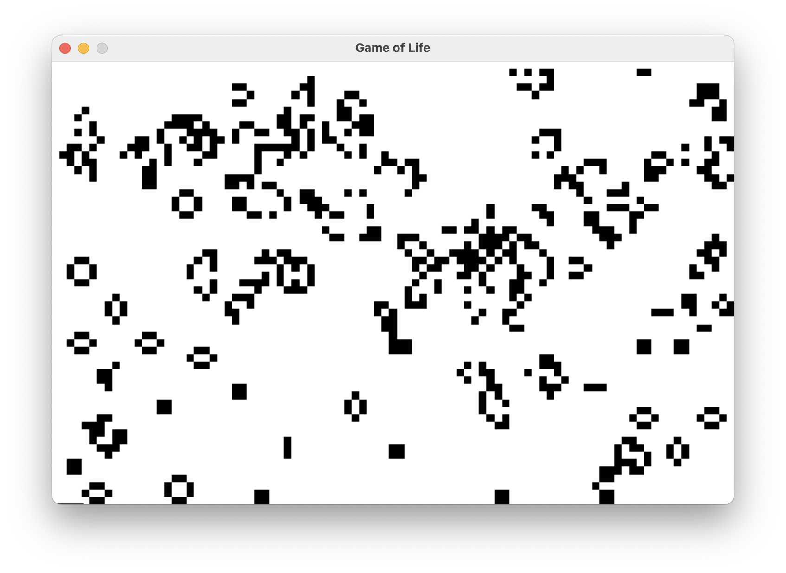
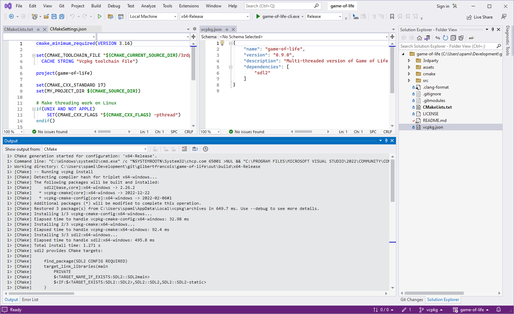

# Game of Life
_Gilbert Francois Duivesteijn_

This program shows the well known Game of Life. I've chosen this simulation as an exercise to explore:

* Member function pointers as function arguments,
* Concurrency, domain slicing and treating boundary conditions,
* Development of a multi platform, multi architecture console and graphical application.
* Using [vcpkg](https://vcpkg.io) C/C++ cross platform dependency package manager as a [CMake](https://cmake.org) extension.


|                                            |                                                  |
| ------------------------------------------ | ------------------------------------------------ |
|  |  |
| Terminal version                           | GUI version (zoom = 8)                           |


## Building on macOS or Linux

The project uses [vcpkg dependency manager](https://vcpkg.io) and is included as a sub-repository in this project. It will automatically download and build libSDL2 for you. 

When cloning the project, don't forget the `--recurse-submodules` option.

```sh
# Clone the project
git clone --recurse-submodules https://github.com/gilbertfrancois/game-of-life.git

cd game-of-life

# Bootstrap vcpkg
./3rdparty/vcpkg/bootstrap-vcpkg.sh

# Build the project and its dependencies
mkdir build
cd build
cmake .. -DCMAKE_BUILD_TYPE=Release
make

```


## Building on Windows with Visual Studio 2022

At the time of writing, Microsoft Visual Studio 2022 cannot work well with git submodules (yet). But it is easy to do the extra steps in a terminal.

- Open a new project and clone from https://github.com/gilbertfrancois/game-of-life.git

- Open ` Tools -> Command Line -> Developer Command Prompt` at solution level and run this command: 

  ```sh
  git submodule update
  ```

- Click `Project -> Delete cache and reconfigure`. CMake will now automatically install vcpkg and libSDL2 for the project. (See screenshot below.)

- Click `Build -> Build All`.




## Running the programs

Open a terminal and type:

```sh
./game-of-life-cli
```

for the text terminal version and

```sh
./game-of-life-gui --fullscreen
```

for the GUI version in full screen. The CLI and GUI programs have different options:

```sh
game-of-life-gui [options]

   --fullscreen          : display full screen.
   --zoom <number>       : zoom factor, default = 1.
   --steps <number>      : number of steps, default = 1000.
   --bt <number>         : boundary type: 0=const, 1=periodic, 2=mirror, default=1.
   --without-threads     : compute single threaded.
   --with-threads        : compute multi-threaded.
   -h, --help            : info and help message.
```

```sh
game-of-life-cli [options]

   --width <number>      : width of the domain, default is current terminal width.
   --height <number>     : height of the domain, default is current terminal height.
   --steps <number>      : number of steps, default = 1000.
   --bt <number>         : boundary type: 0=const, 1=periodic, 2=mirror, default=1.
   --without-threads     : compute single threaded.
   --with-threads        : compute multi-threaded.
   -h, --help            : info and help message.
```

The GUI can be terminated with `[q]` or `[esc]`.


## Game of Life rules

The universe of the Game of Life is [an infinite, two-dimensional orthogonal grid of square](https://en.wikipedia.org/wiki/Square_tiling) *cells*, each of which is in one of two possible states, *live* or *dead* (or *populated* and *unpopulated*, respectively). Every cell interacts with its eight *[neighbours](https://en.wikipedia.org/wiki/Moore_neighborhood)*, which are the cells that are horizontally, vertically, or diagonally  adjacent. At each step in time, the following transitions occur:

1. Any live cell with fewer than two live neighbours dies, as if by underpopulation.
2. Any live cell with two or three live neighbours lives on to the next generation.
3. Any live cell with more than three live neighbours dies, as if by overpopulation.
4. Any dead cell with exactly three live neighbours becomes a live cell, as if by reproduction.


## Boundary conditions

There are 3 possible boundary conditions:

| Number | Type     | Description                                                  |
| ------ | -------- | ------------------------------------------------------------ |
| 0      | Constant | All cells on the perimeter are dead.                         |
| 1      | Periodic | The neighbors to a cell at the edge of the grid are those cells at the opposite edge of the grid. |
| 2      | Mirror   | The neightbors to a cell at the edge have the same value as the cell in the normal direction of the edge. |


## (Member) function pointers as function arguments

If you want to use function pointers as argument, where the function is a member function of a class, you also have to parse a pointer of the instance of the object. At the end of this paragraph, there is a small code example showing the different cases for C style and C++ style function pointers.

The Game of Life simulation uses one function method for domain slicing and distributing the work load over the available CPU cores by starting an equal amount of threads. It takes a function pointer as an argument, to enable me to send the function for initial conditions and the function for time stepping to this method.


**main.cpp**

```c++
#include <cmath>
#include "Foo.h"

int main() {
    Foo *foo = new Foo;

    foo->printOutputCFunction(sin, 1.57);
    foo->printOutputCppMemberFunction(&Foo::add, foo, 1, 2);
    foo->printOutputCppMemberFunctionSelf();
    return 0;
}
```

**Foo.h**
```c++
//
// Created by Gilbert François on 07-09-16.
//
#ifndef FUNCTIONPOINTERS_FOO_H
#define FUNCTIONPOINTERS_FOO_H

class Foo {

public:

    int add(int i, int j);

    // C style for calling function pointer
    void printOutputCFunction(double (*fn)(double), double x);

    // C++ style for calling member functions. It needs a second argument for the reference to the instance
    void printOutputCppMemberFunction(int (Foo::*fn)(int, int), Foo* foo, int i, int j);

    // C++ style for calling member functions, where the object instance calls one of its own functions and providing
    // the instance pointer by the reference 'this'.
    void printOutputCppMemberFunctionSelf();
};


#endif //FUNCTIONPOINTERS_FOO_H
```

**Foo.cpp**
```c++
//
// Created by Gilbert François on 07-09-16.
//
#include <iostream>
#include "Foo.h"

int Foo::add(int i, int j) {
    return i + j;
}

void Foo::printOutputCFunction(double (*fn)(double), double x) {
    double y = fn(x);
    std::cout << std::to_string(y) << std::endl;
}

void Foo::printOutputCppMemberFunction(int (Foo::*fn)(int, int), Foo* foo, int i, int j) {
    int k = (foo->*fn)(i, j);
    std::cout << k << std::endl;
}

void Foo::printOutputCppMemberFunctionSelf() {
    printOutputCppMemberFunction(&Foo::add, this, 7, 3);
}
```


## Domain slicing

The Game of Life simulation can be distributed in many different ways. Since it is a cellular automata, every cell is updated from *t_0* -> *t_1* fully independently. It only needs the states from its direct neighbors. This code used the domain slicing approach, which can easily be applied to other tasks, like image processing. The domain is divided horizontally in row batches. Each slice is then sent to another thread where its new state is computed. After the computation, the threads are joined and the new state is set as the current state (swap buffers). To prevent excessive memory allocation and destruction for each time step, only the memory range of the slice is given to the threads. All threads share the same memory block. This is fine, since they read the current state from buffer 1 and update only their own part in buffer 2.
